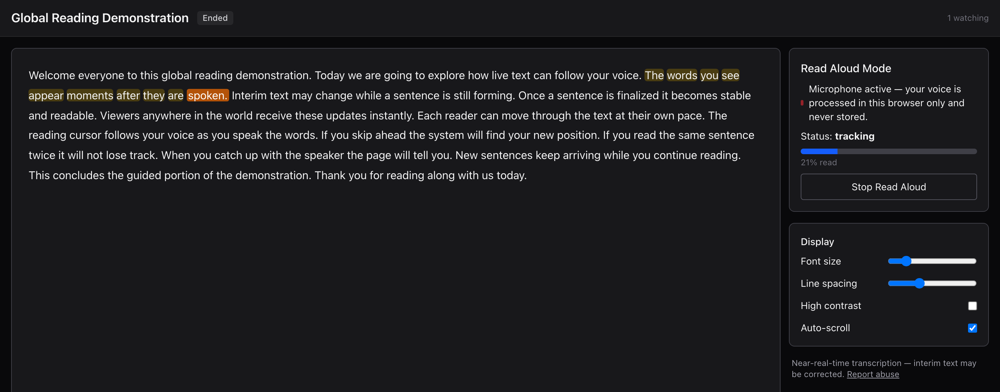
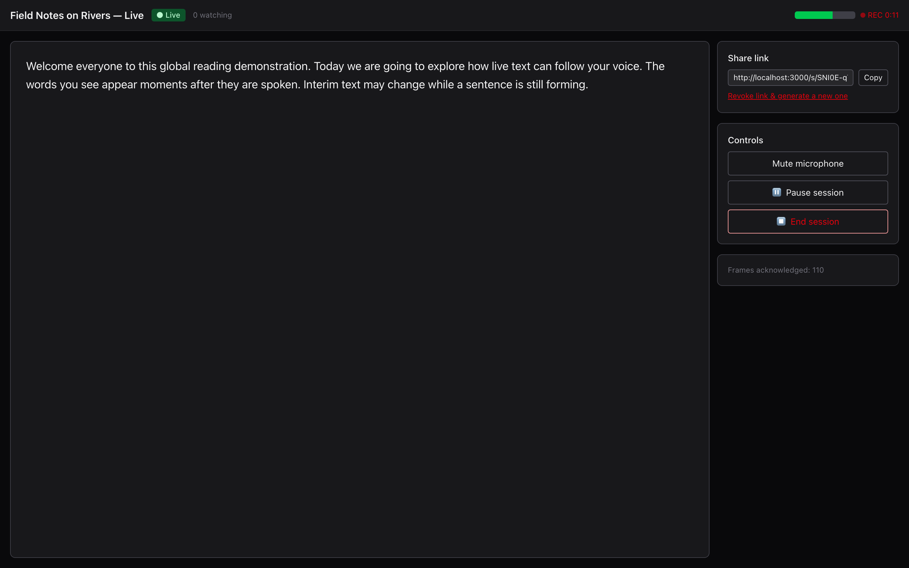
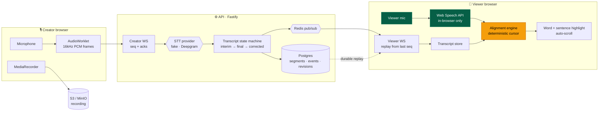

<h1 align="center">LiveRead</h1>

<p align="center">
  <strong>You speak. It becomes text on a web page in near real time.<br/>
  Anyone reading that page aloud sees the highlight follow <em>their</em> voice — at their pace, not yours.</strong>
</p>

<p align="center">
  <a href="https://github.com/koutilyaY/liveread/actions/workflows/ci.yml"></a>
  <a href="https://github.com/koutilyaY/liveread/actions/workflows/security.yml"></a>
  <a href="LICENSE"></a>
  
  
</p>

<p align="center">
  <a href="#quick-start-no-credentials-no-cloud">Quick start</a> •
  <a href="#the-hard-problems">Hard problems</a> •
  <a href="#architecture">Architecture</a> •
  <a href="docs/ALIGNMENT_ENGINE.md">Alignment engine</a> •
  <a href="docs/ARCHITECTURE.md">Architecture doc</a> •
  <a href="docs/LIMITATIONS.md">Limitations</a> •
  <a href="docs/adr/">ADRs</a>
</p>

<p align="center">
  
</p>

<p align="center"><sub>Real capture of the running app — the reader's voice drives the highlight. Nothing here is a mockup.</sub></p>

---

## What is LiveRead?

A creator speaks into their microphone; their words are published as live text to
everyone holding a share link. Any viewer can then press **Read Aloud** and read
that text out loud — and the page follows _their_ voice, independently of how fast
the speaker is going.

It is **not** a meeting bot or a transcription-summary tool. The differentiated
part is the second half: a reader-controlled cursor that survives skipping,
repeating, pausing, mumbling, and starting from the middle.

- 🎙️ **Live capture** — AudioWorklet → 16 kHz PCM frames → streaming STT, with sequence numbers and acks
- 📖 **Read Aloud** — the viewer's own voice moves a word-level reading cursor
- 🎯 **Deterministic alignment** — skips, repeats, backward reading and reacquisition, no LLM in the hot path
- 🔒 **Viewer audio never leaves the browser** — there is no column in the schema that could hold it
- 🔌 **Runs with zero credentials** — a deterministic fake STT provider drives the whole pipeline
- 🧪 **Tested for real** — property-based, integration, 3-browser E2E, load, chaos, accessibility

## Quick start (no credentials, no cloud)

```bash
git clone https://github.com/koutilyaY/liveread && cd liveread
docker compose up --build -d     # postgres, redis, minio, mailpit, api, worker, web
make seed                        # deterministic demo data
open "http://localhost:3000/s/demo-reading-2026#demo-share-token-public"
```

Press **Read Aloud Mode** and read the paragraph out loud. The highlight follows you.

> [!NOTE]
> Read Aloud needs the Web Speech API — Chrome, Edge, or Safari. **Firefox has no
> implementation**, so there you get the manual reading cursor (tap any sentence),
> which is a complete fallback rather than a degraded one.

**Demo login:** `demo@liveread.local` / `liveread-demo-2026` → open _"Live Demo — press Start Speaking"_ to drive the creator side.

## What it looks like

<table>
<tr>
<td width="50%" valign="top">

<sub><b>Viewer.</b> Active word and sentence highlighted, alignment state and reading progress live, microphone processed in-browser only.</sub>
</td>
<td width="50%" valign="top">

<sub><b>Creator studio.</b> Finalized text in white, interim in grey italic, input meter, REC timer, revocable share link, acked frame count.</sub>
</td>
</tr>
</table>

## The hard problems

The parts I'd actually want to talk through in an interview.

<details open>
<summary><b>1. The alignment engine</b> — deterministic reader tracking (42 tests)</summary>

<br/>

Given the canonical transcript and a noisy stream of browser speech-recognition
tokens, decide where the reader is — while they skip, repeat, mumble proper
nouns, pause, or restart mid-paragraph.

It is **deterministic by construction**: no network, no randomness, and every
timestamp is caller-supplied, which is the only reason it can be property-tested
at all. Three search scopes (local tracking → recovery → global reacquisition),
a weighted score over edit distance, bigram overlap, LCS and a phonetic key, and
explicit hysteresis so a single weak match can't teleport the cursor.

The scoring split is the interesting bit: **position continuity ranks candidates,
but jump acceptance is judged on evidence alone.** Letting continuity gate jumps
means a genuine paragraph skip can never be accepted — a bug property-based
testing found, not code review.

Every result carries `reasonCodes` (`high_ngram_overlap`,
`backward_jump_confirmed`, …) so a wrong cursor is debuggable rather than
mysterious.

→ [`docs/ALIGNMENT_ENGINE.md`](docs/ALIGNMENT_ENGINE.md) · [`engine.ts`](packages/shared/src/alignment/engine.ts) · [ADR-0005](docs/adr/0005-deterministic-alignment-engine.md)

</details>

<details>
<summary><b>2. Transcript state & event replay</b> — no duplicates, no lost finals</summary>

<br/>

Streaming recognizers emit rapidly-changing interim text. Naive append produces
duplicate partial phrases; naive replace loses ordering and history.

Segments carry a stable id and a state machine (`provisional → stable_interim →
final → corrected`), a **per-segment revision** for conflict resolution, and a
**per-session sequence number** for transport ordering. Interims update the open
segment in place, so one sentence yields exactly one row no matter how many
interim messages arrive.

Sequence allocation is `UPDATE … SET last_sequence = last_sequence + 1 …
RETURNING` inside the same transaction as the segment write, so any API instance
can ingest and a reconnecting viewer replays from Postgres — Redis is fan-out
only. Losing Redis costs liveness, never durability.

→ [`TRANSCRIPT_STATE_MACHINE.md`](docs/TRANSCRIPT_STATE_MACHINE.md) · [`REALTIME_PROTOCOL.md`](docs/REALTIME_PROTOCOL.md) · [ADR-0006](docs/adr/0006-event-sequence-replay.md)

</details>

<details>
<summary><b>3. Concurrency, and the races found by testing them</b></summary>

<br/>

Transcript corrections use optimistic concurrency. The first implementation
read the revision, checked it, then wrote — a textbook check-then-act race that
survived light testing and collapsed under contention:

```
8 concurrent corrections, before:  1 × 200, 7 × 500   ← unique-violation escaping as a 500
8 concurrent corrections, after:   1 × 200, 7 × 409   ← clean conflict, one winner
```

The fix is a conditional `updateMany` guarded on the expected revision inside the
transaction, with sequence allocation moved inside so a **losing write burns no
sequence number** — viewers rely on sequence contiguity to detect genuinely
missing events.

That test is in the suite permanently:
[`concurrency.integration.test.ts`](apps/api/src/test/integration/concurrency.integration.test.ts).

</details>

<details>
<summary><b>4. Two speech pipelines that must never mix</b></summary>

<br/>

|                           | Creator                          | Viewer                             |
| ------------------------- | -------------------------------- | ---------------------------------- |
| Purpose                   | produce the canonical transcript | locate the reader in existing text |
| Audio leaves the browser? | yes → STT provider               | **never**                          |
| Stored?                   | only with opt-in recording       | **never — no column can hold it**  |
| Writes the transcript?    | yes                              | **never**                          |

Viewer recognition runs entirely in-browser; only a derived position (word index,
sentence index, state, confidence) is reported. That's a schema-level guarantee,
not a policy — asserted by an integration test.

→ [ADR-0004](docs/adr/0004-viewer-audio-non-retention.md) · [`PRIVACY_ARCHITECTURE.md`](docs/PRIVACY_ARCHITECTURE.md)

</details>

## Architecture



Viewer audio (green) never crosses into the server. The alignment engine (amber)
runs in the browser and in Node tests from the **same shared package** — which is
why it can be property-tested offline.

Full detail: [`docs/ARCHITECTURE.md`](docs/ARCHITECTURE.md).

## Test results

<!-- BEGIN:test-results -->

| Suite                             |  Count | What it covers                                                                                                                                                                              |
| --------------------------------- | -----: | ------------------------------------------------------------------------------------------------------------------------------------------------------------------------------------------- |
| Unit, property-based & evaluation | **64** | transcript state machine, tokenization in 6 languages, and the alignment engine — including `fast-check` property tests and a 42-test alignment suite with a 20-scenario evaluation dataset |
| API unit                          | **22** | env/config validation, rate-limit ceilings, and 13 Deepgram **contract tests** against a local server speaking its documented wire protocol                                                 |
| Integration                       | **36** | real Postgres/Redis/MinIO: auth, CSRF, cross-tenant isolation, share revocation & expiry, optimistic-concurrency races, recording finalize, retention deletion                              |
| End-to-end                        | **15** | Chromium · Firefox · WebKit — full creator→viewer live flow, reconnect replay, denied-microphone fallback                                                                                   |
| Accessibility                     |  **2** | axe-core, zero serious/critical violations                                                                                                                                                  |

**122** unit + integration tests, plus 15 E2E across three browser engines.
Load: k6 at 50 VUs, p95 **6.0 ms**, 0 share tokens guessed. Chaos: Redis
restart, recovered in **1 s**. <sub>Generated by `make readme-stats`; `--check` fails CI on drift.</sub>
<!-- END:test-results -->

That table is **generated from real runner output**, not typed by hand — an
earlier version drifted to wrong counts, so `make readme-stats` now rewrites it
and `--check` fails CI on drift.

```bash
make verify              # lint + typecheck + unit + integration + builds
make test-e2e            # 15 tests across Chromium, Firefox, WebKit
make test-load           # k6
make test-network        # chaos: kill Redis mid-session
make test-accessibility  # axe-core
```

## Repository map

| Path                                 |                                                                                                                                                |
| ------------------------------------ | ---------------------------------------------------------------------------------------------------------------------------------------------- |
| [`packages/shared`](packages/shared) | Zod event schemas, transcript state machine, language-aware tokenization, and **the alignment engine** — shared verbatim by server and browser |
| [`apps/api`](apps/api)               | Fastify · Prisma · Postgres · Redis · S3 · WebSockets · STT abstraction · BullMQ worker                                                        |
| [`apps/web`](apps/web)               | Next.js App Router — landing, auth, dashboard, preflight, creator studio, viewer, transcript editor                                            |
| [`infra`](infra)                     | LiveKit, Prometheus, k6 load test, chaos script                                                                                                |
| [`docs`](docs)                       | Architecture, alignment engine, threat model, privacy, accessibility, plus [12 ADRs](docs/adr/)                                                |

## Honest limitations

Reading these is the fastest way to judge the project. Summarized from
[`docs/LIMITATIONS.md`](docs/LIMITATIONS.md), which is deliberately blunt:

- **Recognition quality is unmeasured.** Everything is verified against a deterministic _fake_ STT provider. The Deepgram adapter passes 13 protocol contract tests but **has never run against the live service** — no credentials in the build environment. `make verify-real-stt` closes that gap in one command.
- **Live creator audio isn't wired to the UI.** LiveKit is provisioned; viewers can't hear the speaker yet.
- **Scale is unproven.** Load-tested at 50 VUs on one laptop, not thousands across regions. WebSocket fan-out under load is untested.
- **No UI localization or RTL.** Tokenization and alignment _are_ multilingual and tested (en/es/hi/ar/zh + mixed); the chrome is English-only.
- **No diarization, no summaries, no mobile apps, no SOC 2.** See [how this compares to a mature product](docs/LIMITATIONS.md).

We don't claim zero latency, perfect transcription, support for every browser, or
equal quality across languages. Product copy is held to
[explicit language rules](docs/PRODUCT_REQUIREMENTS.md#language-policy-binding-on-all-copy).

## About this project

> **TODO — fill this in before sharing.** Reviewers said the single biggest gap
> was not knowing _who built this and why_. Suggested shape:
>
> Built by **[your name]** over **[timeframe]** to work through [what you wanted
> to learn: real-time systems / streaming media / full-stack TypeScript]. The
> hardest part was **[e.g. making reader tracking deterministic enough to
> property-test]**. If I started again I'd **[one honest thing]**.
>
> [LinkedIn](#) · [Portfolio](#)

## License

[MIT](LICENSE) © 2026 Koutilya Yenumula
